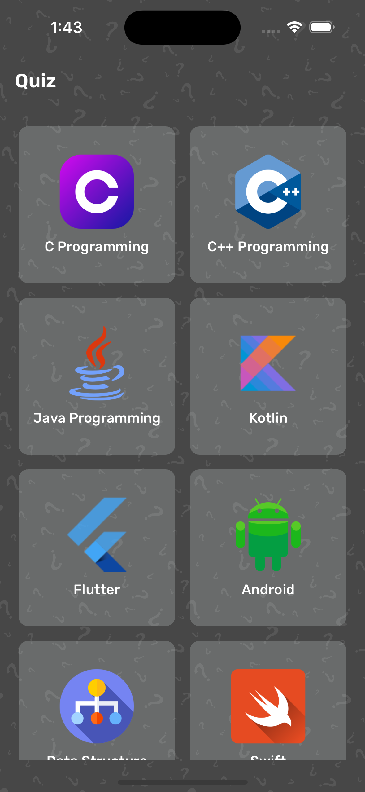
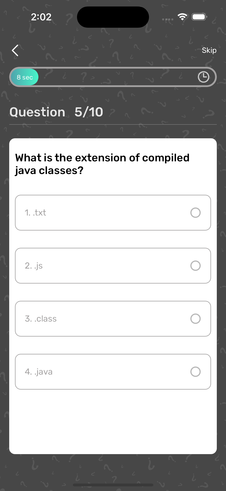
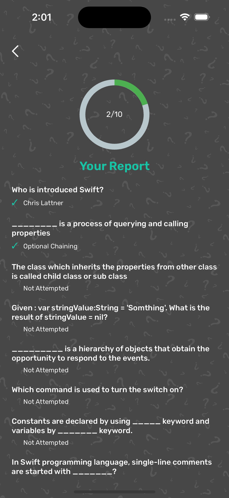

# Quiz Flutter App

This Flutter app allows users to participate in quizzes based on different categories. The app provides features such as timed questions, the ability to skip questions, update answers, and view detailed reports after completing the quiz.

## Features

- **Category Selection**: Users can choose a quiz category from a list of available options.
- **Quiz Rules**: Each quiz question has a time limit of 1 minute. Users can skip questions and attempt them later.
- **Answer Updates**: Users are allowed to update their answers if the time limit for the question is not complete.
- **Report Generation**: After completing the quiz, users can view a detailed report of their performance.

## Modules

1. **Category Page**: Allows users to select a quiz category.
2. **Quiz**: Conducts the quiz, presenting questions one at a time with a time limit.
3. **Report Page**: Displays the quiz results and performance report.

## State Management

The app utilizes GetX for state management, offering a lightweight and reactive approach to manage app states efficiently.

## Technology Stack

- Flutter: Framework for building cross-platform mobile applications.
- GetX: State management library for Flutter.

You can download the apk from the [link](https://drive.google.com/file/d/1jpsKBm424zK2jBMcl5VXk0iy8URqoOT_/view?usp=sharing)

## Screenshots

   
